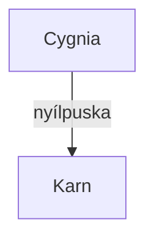

# A Zászlóháború győztes vesztesei - KM háttéranyagok

* [Háttér, az aquirok](./Hatter.md)
* NJK
  * ["Begyűjtők" rabszolgavadász csapat](./NJK/Begyujto_dezertorvadaszok.odt)
  * [Cygnia, a boszorkány](./NJK/Cygnia.gazda.lanya.boszi.md)
  * [Farkasok](./NJK/Farkasok.odt)

---
## 7. alkalom terv
* Attila páncéljának MGT-jét növelni! (sérülések hatása)
* Attila pajzsa nagyon rossz állapotban (csökkentett VÉ, MGT+ ?)      → karakteralkotóban is kezelni külön az egyes elemek sérülését. Külön fül a páncélnak!
* 5000-es városka térkép keresése (Amlois város számára)

### Cselekmény terv

* A Mantikor harcosok egyes hulláiból bogarak másznak ki (Hasss'Nish rituáléjával fogadták magukba ezeket az állatokat, ami csak egy fricska Hasss'Nish részéről Pekkkt' felé - utalva születésére).

* Látnak menekülni egy mantikor katonát, ha követik, barlangrendszerhez jutnak.
* Követésnél: falakon felfut könnyen (a ritusok adománya)
* Hasss'nish agyzsibbasztó rúnái a falakon. Kyr rúnákba ágyazva. Ha ránéznek, fejfájás.
* bogarak mindenütt: ez a "korai rajzás" aspektusának barlang-régiója.
* Gyerekek rohangálnak. Egyik-másiknak kéz helyett bogár csápjai vannal. Reakcióik: "Hol vannak a bogár Pietorok?"
* Megtalálják az al-központot. Kis harc 4 ellenféllel. Áldozati kegyhely bogár és kyr rúnákkal.

* Halászék beérik őket? Pont a barlangokban? Nagy manitor rush, ideiglenesen összefognak?

---

## Klánok
* Mantikor: Toroni gyökerű klán (szökött toroni katonák, tisztek alapították), de egy aquir szolga (Hasss' Nissh) befolyása alá kerültek. Őt imádják torz formában.
* Saniferum boszkorkányrend: Cygnia itt tanult, 2 napnyira van a farmtól. Jó boszorkányok a tagjai. Egy nagyon öreg elf vezeti őket.
  * Rendfőnök: Lacerta  (Gyík csillagképből jön a név)
* Vérköpő klán: a Daibol hegység közepén rejtőző klán. (#TODO: NJK file)

## Vegyes ötletek
• Kyr különítmény??
• Hasss'Nish rúnái egy barlang falán? 

• talának egy kódexet régi elbeszéléssel, amiben archaikus stílusban egy nagy hatalmú lénnyel csatáznak. Elég beszaratós.

• nagyobb területet (pl. tó, mocsár, zuhatag) megszállt (női princípiumú) természetszellem felfigyel rájuk
    • csak ott terjed ki a befolyása, csak ott tud segíteni / ártani

---

## Nevek talonban
* Vulpec  (Vulpecula: Róka csillagkép)

---

* Mermaid chart syntax: https://mermaid-js.github.io/mermaid/#/
* Mermaid chart simple example: https://github.blog/2022-02-14-include-diagrams-markdown-files-mermaid/

