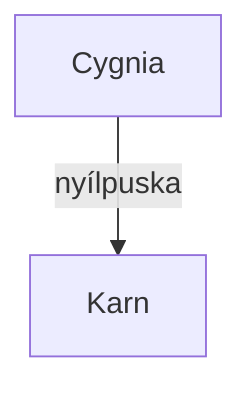

# A Zászlóháború győztes vesztesei - KM háttéranyagok

* [Háttér, az aquirok](./Hatter.md)
* NJK
  * ["Begyűjtők" rabszolgavadász csapat](./NJK/Begyujto_dezertorvadaszok.odt)
  * [Cygnia, a boszorkány](./NJK/Cygnia.gazda.lanya.boszi.md)
  * [Farkasok](./NJK/Farkasok.odt)

Mermaid chart syntax: https://mermaid-js.github.io/mermaid/#/
Mermaid chart simple example: https://github.blog/2022-02-14-include-diagrams-markdown-files-mermaid/

